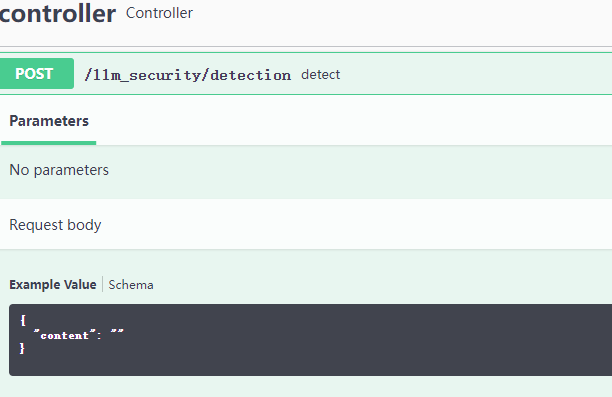

### llm_security(大模型内容安全)

利用分类法和敏感词检测法对生成式大模型的输入和输出内容进行安全检测，尽早识别风险内容。

The input and output contents of generative large model are checked by classification method and sensitive word detection method to identify content risk as early as possible.
-----------------------------------------------------------------------

### usage
【ServiceApplication.java】

相关模型下载：https://github.com/jiangnanboy/text_security_audit

使用者可自行训练bert类相关模型，用本项目加载即可。

本项目采用java, springboot实现。

* 敏感词(sensitive word detection)

* 政治类(politics detection)

* 暴恐类(violence detection)

* 色情类(porn detection)

* 辱骂歧视类(insult detection)

 

### requirement
- java11+
- onnxruntime1.11.0
- springboot2.6.4

### contact me
- github：https://jiangnanboy.github.io

